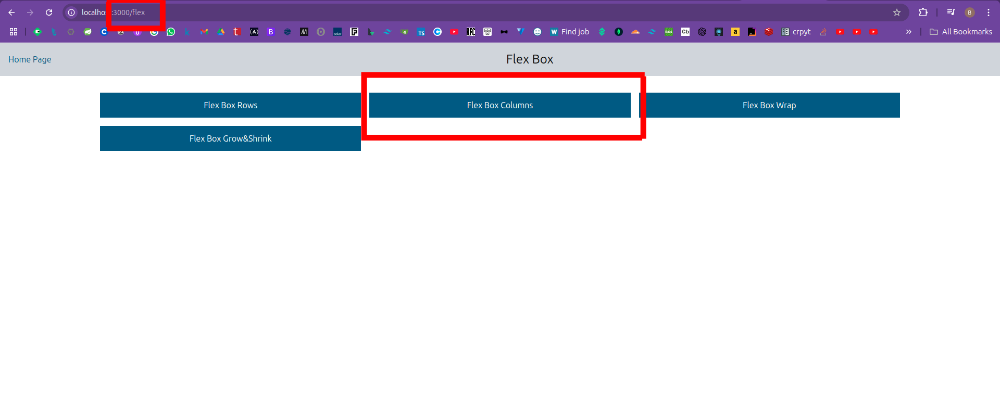

## Tailwind Css Study on next.js app

## Getting Started

First, run the development server:

```bash
npm run dev
# or
yarn dev
# or
pnpm dev
# or
bun dev
```

## Display Images from Public Folder

To display images from the public folder, use the following syntax:

### Select which tailwind component you want to choose


### Select which tailwind subcomponent you want to choose

Each Route is an component of tailwind css


### Select which tailwind subcomponent you want to choose

Try code block to display how tailwind appers on browser. Change and try tailwind properties.

